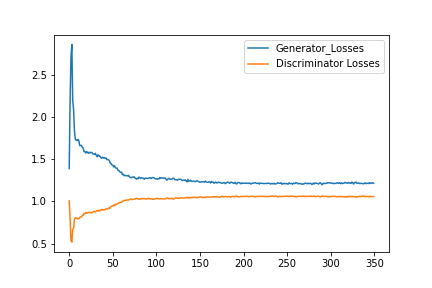

# Vanilla-GAN

PyTorch implementation of [Generative Adversarial Networks](https://arxiv.org/abs/1406.2661) by Ian Goodfellow et al.

### Loss

Binary Cross Entropy loss was used to train both generator and discriminator. Loss curve for first 200 epochs is given below.
<div align='center'>
   
</div>

### Model

The generator model file is available. Load it like this
```python
import torch

...

model = Generator()
state = torch.load('mnist_generator.pth')
model.load_state_dict(state)
model.eval()

...
```

